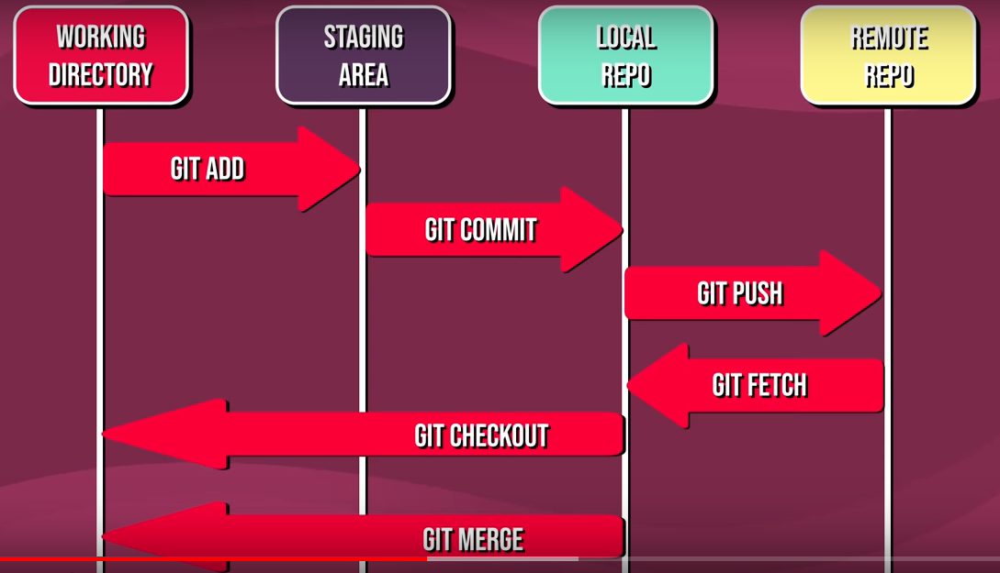

# git-workshop
basic intro to git 

# Curriculum
## Basic (Individual)
1. Configure git

configure the user which will be used by git
Of course you should use your name  
`git config --global user.name "Example Surname"`  
Same for the email address  
`git config --global user.email "your.email@gmail.com" `  
2. `git clone [url]`  
3. `git status`  
4. `git add <filname>` or `git add .`  
5. `git commit -m <message>` and `git commit -am <modified message>`     
6. `git push`    
7. `git pull`  vs `git fetch`  
8. `git log --filname`   
9. `.gitignore`

## Advanced ( In a team)
1. create a new branch `git branch <branch-name>`  
   list all branches `git branch`  
   switch to existing branch `git checkout <branch-name>`  
   create a branch and switch to it `git checkout -b <branch-name>`
2. Merge two branches
  `git merge <source>`:(SOURCE to target) (make sure to be on target)
3. Remote 
4. 
   
   

## Documentation

## GitHub Issues

## Samurai Tricks

## Reference
1. https://glfmn.github.io/gh-slides/
2. https://github.com/k88hudson/git-flight-rules
